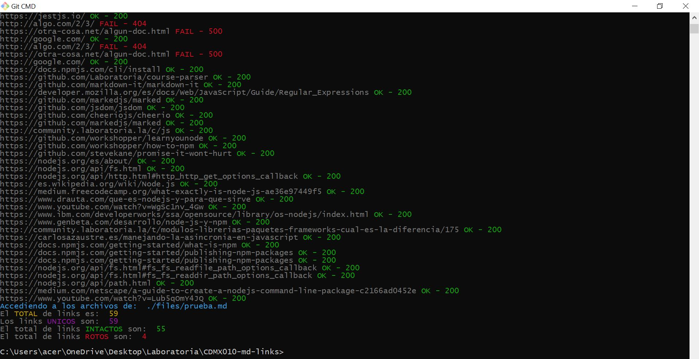
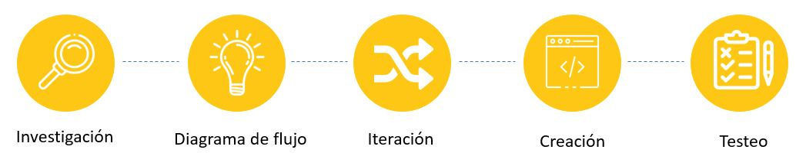
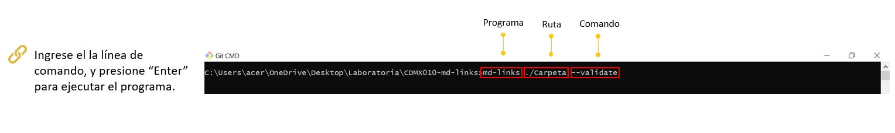
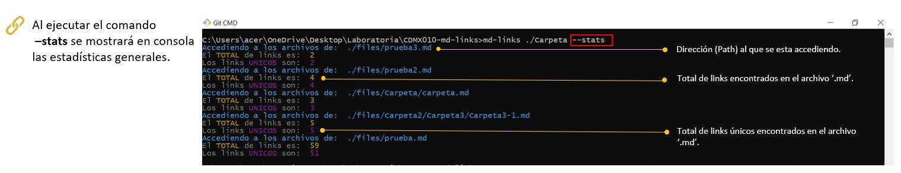
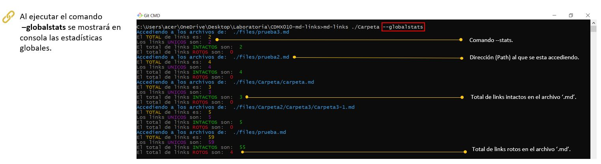
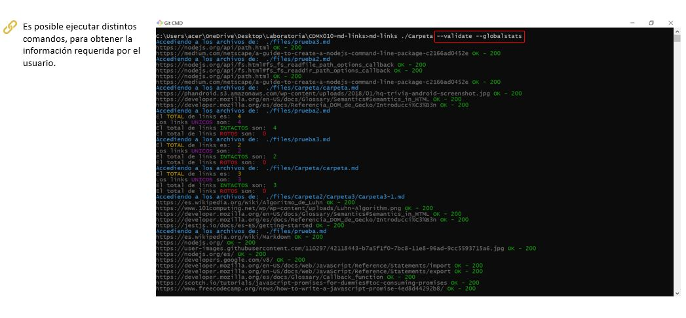

# Markdown Links
Librería para validación de links en archivos Markdown.

## El Proyecto

Se busca crear una librería en Node.js que permita la lectura y análisis de archivos con extensión '.md'.

**Duración:** 4 semanas.

**Métodos:** Investigación, Ideación, Creación y Testeo.

**Herramientas:** JavaScript, Node.js, y Chalk.

## Contexto

Pensando en la comunidad de developers y sus necesidadesde al trabajar en un nuevo proyecto, se creó **md-Links** una librería que permite leer el contenido de archivos con extensión '.md', obteniendo y analizando los links que se encuentran en el, mostrandolé al usuario reportes con estadísticas del análisis.

## Proceso

## Usabilidad

## Comandos

## Retrospectiva

Este proyecto ha sido muy retador, me sacó aún más de mi zona de confort y me orilló a ampliar mi proceso de análisis. Sin duda me encontré con muchos tropezones y momentos de bloqueo, pero al final gracias al acompañamiento de mis Coaches, apoyo de mis compañeras y dedicación, pude culminar este proyecto satisfactoriamente.

Comprendí que la descomposición del código muchas veces es necesario para su iteración, encontré nuevas fuentes de consulta y librerías externas muy útiles para la ejecución del programa. 

**¡Si tienes cualquier tipo de feedback o comentario, estaría muy agradecida que me lo hicieras saber!**

#### agarcia_pacheco@hotmail.com